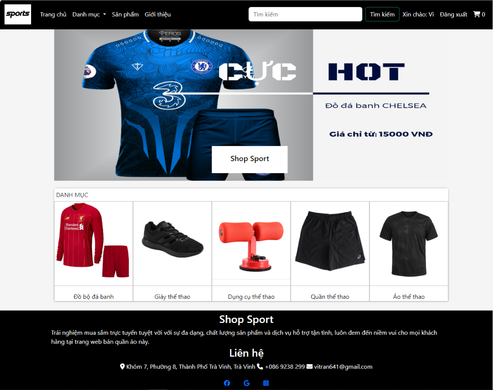
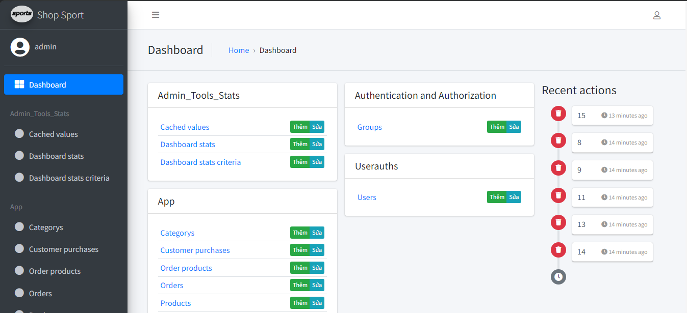

# Chuyên ngành - DA20TTA - Trần Phúc Vĩ - eshop - Django

## Giao diện trang chủ

## Giao diện trang Admin

## Cách cài đặt
- Cài đặt Python và pip để khơi chạy lệnh
- Trước tiên clone dự án về máy
  ```bash
    git clone https://github.com/TpVix/cn-da20tta-tranphucvi-eshop-django.git
  ```
- Sau đó truy cập vào bên trong dự án
  ```bash
    cd cn-da20tta-tranphucvi-eshop-django
    cd src
  ```
- Khởi chạy lệnh tạo cơ sở dữ liệu
  ```bash
    python manage.py makemigrations
  ```
- Khởi chạy lệnh lưu các thay đổi của dự án
  ```bash
    python manage.py migrate
  ```
- Khởi chạy lệnh để dự án được khởi động và truy cập vào 'http://127.0.0.1:8000/'
  ```bash
    python manage.py runserver
  ```
***
## Thông tin liên hệ
- Họ tên: Trần Phúc Vĩ
- SĐT: 0869238299
- Email: vitran641@gmail.com
